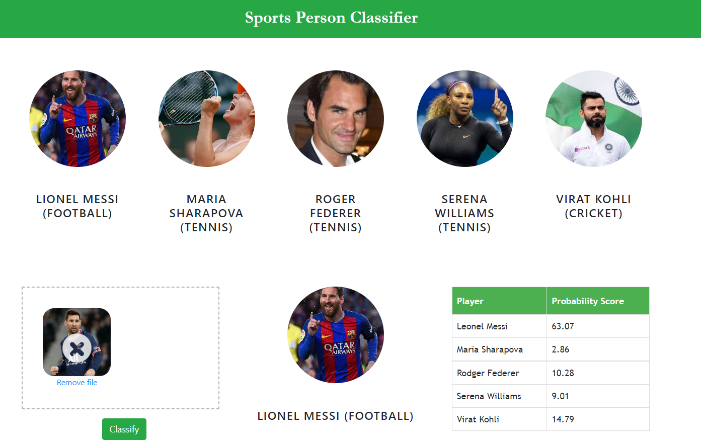

# Sports Person Classifier

In this data science and machine learning project, we classify sports personalities using SVM Multiclass classifier. We restrict the classification to only 5 people:

1. Maria Sharapova
2. Serena Williams
3. Virat Kohli
4. Roger Federer
5. Lionel Messi

**Folder structure:**

- UI : This contains UI website code
- server: Python flask server code
- model: Contains python notebook for model building and pickle file generation
- model->dataset:Image Dataset used for our model training
- model->Manually Cropped Images: Images manually selected which are Non-Blurry and represent the specific sportsperson only
- model->opencv: Contains the 'Haar Cascade Classifier' used for Data cleaning
- model->test_images: Contains sample images for testing the algorithm

**Required libraries**: NumPy, Pandas, Matplotlib, Scikit learn,Flask,Joblib, OpenCV,PyWavelets,Seaborn,JSON

**Technologies used in this project:**

1. Python
2. Numpy and OpenCV for data cleaning
3. Matplotlib & Seaborn for data visualization
4. Sklearn for model building
5. Jupyter notebook, visual studio code and pycharm as IDE
6. Python flask for http server
7. HTML/CSS/Javascript for UI

## How to Collect Training Image dataset?

Use 'Fatkun Batch Download Image' chrome extension to search images of the concerned sportsperson and download them.

## How to use the model to make predictions?

1. Navigate to the folder 'model'.
2. Run the "Model_generator.ipynb" Jupyter notebook till 'First Indexing' heading.This creates the 'cropped' folder in "model/datasets"
3. Manually delete the images which look blurry or the image is not of the concerned personality. The manual data cleaning has been done already and the images are stored in the folder. 'model/Manually Cropped Images'. The contents of this folder can be copied and pasted in the 'model/dataset' folder to avoid the manual data cleaning.
4. Run the rest of the code. This re-indexes the dataset image files,trains the defined model and then saves the model in a pickle file.
5. Copy the saved pickle model 'saved_model.pkl' and the 'class_dictionary.json' files into the folder 'server/artifacts' by navigating to it from the main root folder.
6. Navigate to 'server' folder and run "server.py" using any Python compiler
7. Navigate to 'UI' folder and open "app.html" with any Web Browser. This opens the GUI.
8. Select any image from 'server->test_images' folder and upload it in the website.
9. Click on 'Classify' button to display the prediction on that image

## GUI Snapshot

We give the input of image which contains 'Messi' and the model has not seen this image before. The model detects the sportsperson in the image correctly

  
